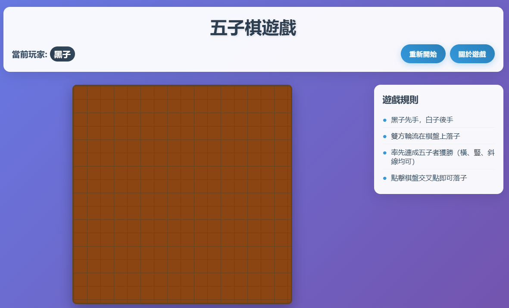

# 五子棋遊戲網站

基於 Flask 的全端五子棋遊戲網站，支持雙人對戰。



## 功能特色

- 🎯 15×15 標準五子棋棋盤
- ⚫⚪ 黑白雙人對戰
- 🏆 自動勝負判斷（五子連線）
- 🔄 一鍵重新開始
- 📱 響應式設計，支持手機端
- 🎨 現代化 UI 設計
- ⌨️ 鍵盤快捷鍵支持

## 技術棧

- **後端**: Python Flask
- **前端**: HTML5 + CSS3 + JavaScript
- **模板引擎**: Jinja2
- **樣式**: 響應式 CSS，漸層背景，動畫效果

## 安裝與運行

### 1. 安裝依賴

```bash
pip install -r requirements.txt
```

### 2. 運行應用

```bash
python app.py
```

### 3. 訪問網站

打開瀏覽器訪問: `http://localhost:5000`

## 遊戲規則

1. 黑子先手，白子後手
2. 雙方輪流在棋盤交叉點落子
3. 率先在橫、豎、斜任一方向連成五子者獲勝
4. 棋子只能放在空白的交叉點上

## 操作說明

- **滑鼠**: 點擊棋盤交叉點落子
- **重新開始**: 點擊「重新開始」按鈕或按 `R` 鍵
- **關於遊戲**: 點擊「關於遊戲」按鈕查看詳細規則
- **關閉彈窗**: 按 `ESC` 鍵或點擊背景

## API 端點

- `GET /` - 主頁面
- `POST /move` - 落子 API
- `POST /reset` - 重置遊戲
- `GET /status` - 獲取遊戲狀態

## 項目結構

```
├── app.py              # Flask 主應用
├── requirements.txt    # Python 依賴
├── templates/          # HTML 模板
│   └── index.html     # 主頁面
├── static/            # 靜態資源
│   ├── style.css      # 樣式文件
│   └── script.js      # JavaScript 邏輯
└── README.md          # 項目說明
```

## 開發說明

- 遊戲狀態存儲在後端記憶體中
- 支持同時僅一局遊戲
- 前端使用 AJAX 與後端通信
- 響應式設計適配各種螢幕尺寸

## 瀏覽器支持

- Chrome (推薦)
- Edge
- Firefox
- Safari

## 未來擴展

- [ ] AI 對戰模式
- [ ] 玩家登入系統
- [ ] 遊戲記錄保存
- [ ] WebSocket 多人對戰
- [ ] 自定義棋盤大小